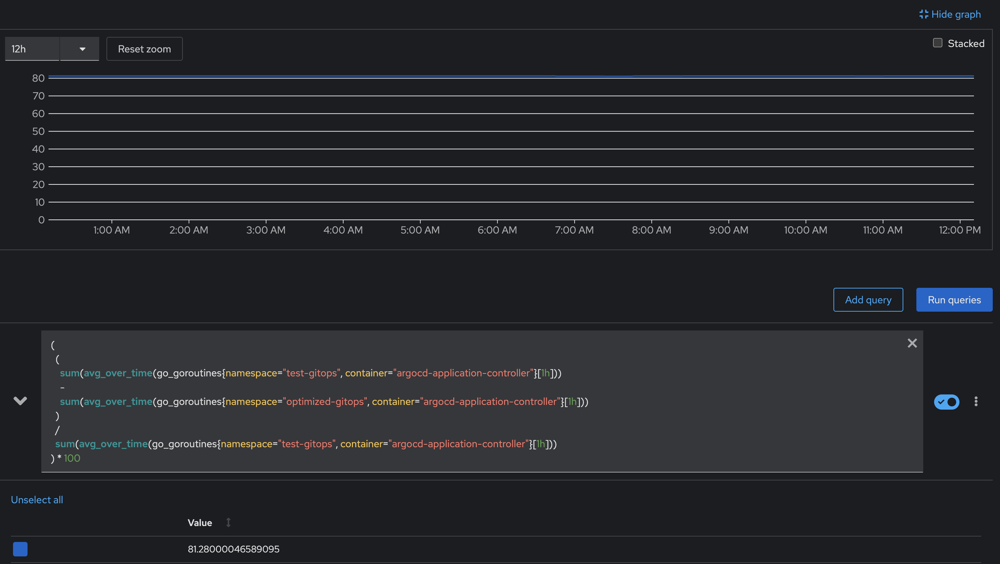

# Performance Benchmarks
This document provides a detailed overview of the performance improvements gained by using the resource-tracker to optimize an Argo CD installation.

## Methodology
All benchmark comparisons in this document are based on the average metric value over a one-hour period. This approach smooths out short-term spikes and provides a more accurate, stable, and fair comparison of sustained system performance.

The following metrics were captured from a Prometheus instance monitoring two Kubernetes namespaces:

* test-gitops: A standard Argo CD installation without optimizations.

* optimized-gitops: An identical Argo CD installation using the resource-tracker to exclude certain resources from being tracked.

The results below show the percentage reduction in resource consumption for the argocd-application-controller in the optimized namespace compared to the standard one.

The percentage improvement is calculated using the following formula:
```
Percentage Reduction = ((Value from test-gitops - Value from optimized-gitops) / Value from test-gitops) * 100
```

## Results Summary

| Metric | Improvement |
| :--- | :--- |
| **Go Routines** | ~81% Reduction |
| **CPU Usage** | ~66% Reduction |
| **Watch API Resource Objects** | ~33% Reduction |
| **Memory Allocation** | ~30% Reduction |
| **Watch API Resources** | ~90% Reduction |
| **Heap In-Use** | ~25% Reduction |
| **Heap Memory Allocation** | ~30% Reduction |

## Detailed Metrics
Below are the graphical results from our performance tests.

1. Go Routines  
  
Measures the number of running goroutines, indicating a reduction in concurrent operations.  
Result: ~81% reduction

2. CPU Usage  
  
Measures the rate of total CPU time spent by the process.  
Result: ~66% reduction

3. Watch API Resource Objects  
  
Measures the number of API resource objects being watched by the controller.  
Result: ~33% reduction

4. Memory Allocation  
  
Total bytes of memory allocated for heap objects.  
Result: ~30% reduction

5. Watch API Resources  
  
Measures the number of distinct API resources being watched.  
Result: ~90% reduction

6. Heap Memory In-Use  
  
Bytes in in-use spans.  
Result: ~25% reduction

7. Heap Memory Allocation  
  
Bytes of memory allocated from the heap.  
Result: ~30% reduction